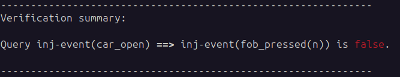
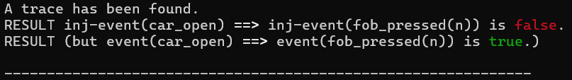
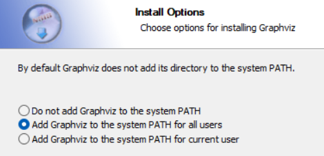
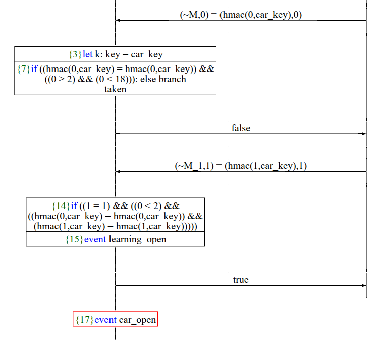

# Rollback attack formal verif

_ProVerif proof of concept of the Rollback attack on car keyfob (CVE-2022-37418, CVE-2022-36945 and CVE-2022-37305), presented in [[1]](#1)_

---

## Disclaimer

I have no connection with the authors of [[1]](#1). I am grateful to them for making their paper open access.

## ProVerif installation

### Official method

To run the ProVerif formal verif PoC, first install ProVerif by following the instructions on [the official page](https://bblanche.gitlabpages.inria.fr/proverif/).


### Prebuilt binary

Alternatively, I pre-compiled a static binary for Linux on amd64 architecture, available on the [release page of the repository](https://github.com/thomasarmel/rollback_car_attack_proverif/releases/tag/proverif_static). There is also the executable for Windows.

Make sure to add execution permission to the downloaded the executable:

```bash
chmod +x proverif_linux_amd64_static
```

## Usage

### Clone the repository

```bash
git clone https://github.com/thomasarmel/rollback_car_attack_proverif.git
cd rollback_car_attack_proverif/
```

### Run the verification on the model

```bash
proverif model.pv
```

You should see that the opening of the car doesn't imply that the key fob has been pressed, meaning the attacker succeeded in opening the car:



Exactly, this query means that it is possible to trigger the opening mechanism a number of times greater than the number of presses on the key fob.

#### Need to press the key fob

We can notice that while the query

```proverif
inj-event(car_open) ==> inj-event(fob_pressed)
```

returns `false`, Proverif tells us that the query

```proverif
event(car_open) ==> event(fob_pressed)
```

would have returned `true`:



It means that the fob must be pressed to open the car, but the car can be opened a number of times grater than the number of key fob presses.

### Generating the graph of the attack

#### Graphviz

In order to generate the trace pdf, ProVerif needs graphviz being installed and added to the PATH env variable.

You can install it on Linux using:

```bash
sudo apt update
sudo apt install graphviz
```

On Windows, you can download the installer at https://graphviz.org/download/ . Make sure to add the installation folder to the PATH env variable:




#### Graph generation

To generate the graph detailing the attack, run

```bash
proverif -graph . model.pv
```

Now open the generated pdf file, and see how the attacker can trigger car opening without the key fob being pressed:



## References

<a id="1">[1]</a> *Csikor, Levente and Lim, Hoon Wei and Wong, Jun Wen and Ramesh, Soundarya and Parameswarath, Rohini Poolat and Chan, Mun Choon*, **Rollback: A new time-agnostic replay attack against the automotive remote keyless entry systems**, ACM Transactions on Cyber-Physical Systems, 2024, https://doi.org/10.1145/3627827
